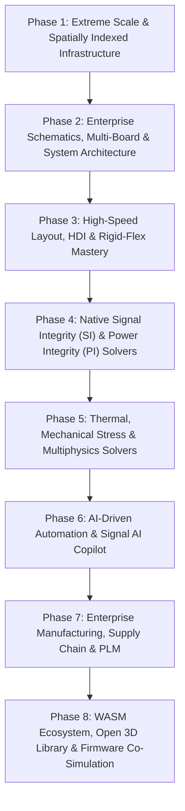

# Oxide EDA vs. Altium Designer: Deep Competitive Analysis & Industrial Evolution Roadmap

> **Document Class:** Technical Master Architecture & Competitive Strategy  
> **Status:** Active Master Specification (Time-Agnostic, Feature- & Physics-Driven)  
> **Target Scope:** Enterprise Motherboards (30+ layers), 112G+ SerDes / PCIe Gen 6 / DDR5, High-Density Interconnect (HDI), Aerospace Rigid-Flex, Native GPU SI/PI/CFD Solvers, Hardware-as-Code CI/CD.

---

## Part I. Deep Analysis: Oxide EDA vs. Altium Designer

| Feature Category | Altium Designer (The Incumbent) | Oxide EDA (The Challenger Architecture) | The Competitive & Architectural Gap |
| :--- | :--- | :--- | :--- |
| **Core Architecture & Performance** | Legacy C++/C# codebase (Delphi legacy heritage). High memory footprint; stalls on 50+ layer, 100k+ pin boards. CPU rasterization. | **Rust + WGPU (wgpu 27)**. Zero-cost abstractions, data-oriented memory layout, parallel Rayon computing, multi-threaded GPU-instanced rendering. | Oxide delivers 60 FPS viewport navigation and sub-second layout queries on million-pad backplanes where Altium suffers severe rendering bottlenecks. |
| **Data Management & Versioning** | Proprietary binary/hex container files (`.PcbDoc`, `.SchDoc`). Requires Altium 365 cloud workspace for change tracking. Conflicts require manual merge. | **Git-Native (`.snx*`)**. Clean TOML headers + TSV tabular payloads that are line-diffable in standard git. 5× smaller footprint than raw JSON. | Built for **Hardware-as-Code** and automated CI/CD pipelines (GitHub Actions, GitLab CI) with programmatic pull-request gates and zero merge conflicts. |
| **Signal Integrity (SI)** | Relies on external third-party integrations (Keysight Signal Analyzer, Cadence Sigrity, HyperLynx) requiring costly secondary licenses. | Built-in GPU-accelerated **2.5D BEM / 3D FDTD & MoM EM Field Solvers** + Touchstone S-parameter engine (`oxide-compute`, `oxide-rf`). | Oxide eliminates 3rd-party license costs and data translation overhead with native, real-time in-canvas channel analysis, eye diagrams, and dispersion modeling. |
| **Power Integrity (PI)** | Relies on CST Studio PDN Analyzer for DC IR Drop and thermal simulations. Clunky mesh export and slow turnaround. | Native **PDN Analyzer (`oxide-sim`)** using GPU sparse-matrix resistive/mesh solvers for live DC IR drop, current density heatmaps, and AC PDN impedance. | Live thermal/voltage plane feedback during routing prevents plane necking, rail collapse, and electromigration under high transient CPU/GPU current steps. |
| **Mechanical & HDI Stackups** | SolidWorks/PTC Creo STEP bridges; rigid-flex 3D bending with manual layer definition. | **Dynamic 3D Kinematics & Mesh Deformation Engine** with flex bend radiuses, stiffeners, blind/buried microvias, and automated backdrilling. | Provides real-time clearance checking in folded enclosures, cross-probing strain zones against copper routing, and multi-board cable harness co-design. |
| **Simulation Ecosystem** | Basic SPICE simulation with limited digital/MCU integration; no true firmware co-execution. | **Unified Multi-Domain Co-Simulation (`oxide-cosim`, `oxide-mcu`)**: QEMU MCU emulation (ARM/RISC-V/Xtensa/AVR), SPICE, Protocol analyzers, FPGA IPC. | Firmware engineers can run production C/C++/Rust firmware against virtual hardware peripherals, external memories, displays, and analog nets before fabrication. |

---

## Part II. Master Improvement Plan: 8 Industrial Evolution Phases

---

### Phase 1: Extreme Scale & Next-Generation Data Infrastructure

> **Goal:** Transform the core layout and netlist derivation engine into a high-throughput, spatially indexed data architecture capable of sub-millisecond queries on 1,000,000+ geometric entities.

#### Task 1.1: Spatial Indexing (R-Tree / BVH / Quadtree) for DRC & Routing
- **Architecture**: Implement a multi-threaded, lock-free R-Tree and Bounding Volume Hierarchy (BVH) spatial indexing structure in `oxide-types`.
- **Performance Invariant**: Reduce geometric collision checks in real-time Design Rule Checking (DRC) and interactive push-and-shove routing from $\mathcal{O}(N^2)$ to $\mathcal{O}(N \log N)$.
- **Implementation Details**:
  - Partition board layers into spatial clusters with SIMD-accelerated AABB (Axis-Aligned Bounding Box) overlap tests.
  - Support dynamic incremental updates on interactive drag, rotate, and push-and-shove trace maneuvers.

#### Task 1.2: Database-Backed Project Architecture (`.snxdb`)
- **Architecture**: Introduce a memory-mapped, zero-dependency embedded database (custom Rust-based LSM tree or SQLite engine via memory-mapping) for massive server boards.
- **Data Model**: Maintain `.snxprj` human-readable TOML manifests while streaming multi-gigabyte geometry records, polygon meshes, and footprint instances from `.snxdb` blocks on demand.
- **Cache Invalidation**: Implement dirty-region bitmasks ensuring instantaneous saving and load times (<500ms for 30+ layer server motherboards).

#### Task 1.3: Distributed & Parallel Netlist Connectivity Derivation
- **Engine**: Parallelize `oxide-net` graph union-find derivation using `rayon` work-stealing thread pools.
- **Hierarchical Caching**: Compute net partitions and sub-sheet connection matrices with SHA-256 content hashes; unchanged schematic sheets reuse cached netlists and pin maps.

#### Task 1.4: Hardware-as-Code Headless CI/CD Toolchain (`oxide-cli`)
- **CLI Utility**: Ship `oxide-cli` with zero headless GUI dependencies.
- **Automated Gates**: Provide official GitHub Actions and GitLab CI workflows to execute automated ERC, DRC, impedance rule checks, and BOM drift validation on every git Pull Request, rejecting merges on rule violations.

---

### Phase 2: Enterprise Schematic & System-Level Architecture

> **Goal:** Support complex multi-board systems, cable harnesses, assembly variants, and mixed-signal simulations for automotive, aerospace, and computing backplanes.

#### Task 2.1: Multi-Board & System-Level Logical Linking
- **System Architecture**: Implement system-level project manifests linking multiple child `.snxprj` board targets.
- **Inter-Board Net Propagation**: Propagate high-speed differential pairs and power rails across backplane connectors (e.g. `BoardA::J1.TX_P` $\rightarrow$ `BoardB::J3.RX_P`).
- **Real-Time Cross-Board Probing**: Clicking a net in Board A's schematic highlights the matching connector pin and route in Board B's 3D layout.

#### Task 2.2: Advanced Wire Harness & Cable Design
- **Harness Editor**: Dedicated tool to specify wire gauges (AWG), twisted pairs, coaxial shielding, terminal crimps, and pinout tables.
- **2D Formboard Flattening**: Generate manufacturing nail-board drawings with accurate segment lengths, branch breakout coordinates, and wire cut lists.

#### Task 2.3: Deep Simulation Model Integration (SPICE & IBIS)
- **IBIS Parser**: Native parser for IBIS 5.0/6.0/7.0 models (extracting $I/V$ pull-up/pull-down curves, $V/T$ transition waveforms, and pin parasitic $R/L/C$ values).
- **SPICE Engine**: Integrate transient, AC small-signal, and DC operating point simulation directly into the schematic view with probe point overlays.

#### Task 2.4: Parametric Variant & Assembly Management
- **Variant Engine**: 100% parametric population control (`Fit`, `No-Fit / DNP`, alternate value/footprint substitution).
- **Automated Outputs**: Dynamically generate variant-specific schematics (striking through DNP components), variant BOMs, and Pick-and-Place (CPL / XY) tables.

---

### Phase 3: High-Speed Layout, HDI, & Rigid-Flex Mastery

> **Goal:** Provide first-class support for microvia HDI stackups, automated backdrilling, dynamic 3D rigid-flex deformation, and thermal copper balancing.

#### Task 3.1: Advanced HDI & Microvia Stackup Manager
- **HDI Classes**: Type 1 (1+N+1), Type 2 (2+N+2), Type 3 (3+N+3), and Any-Layer HDI (ALH / ELIC) stackup architectures.
- **Via Geometries**: Blind vias, buried vias, staggered microvias, and stacked copper-filled microvias.
- **Via-in-Pad (VIP)**: VIPPO (Via-in-Pad Plated Over) rules, planarization checks, and solder-mask clearance validations for 0.4mm/0.35mm pitch BGAs.

#### Task 3.2: Automated Controlled-Depth Backdrilling Engine
- **Stub Elimination**: Automatically compute backdrill depth from the surface to the active high-speed internal layer, eliminating open via stubs causing resonance at >10 GHz.
- **Manufacturing Outputs**: Generate dedicated backdrill Excellon files, stub clearance DRCs, and non-functional pad removal flags.

#### Task 3.3: Dynamic Rigid-Flex 3D Kinematics
- **Mesh Deformation**: Define flexible zones with stackup substacks, bend radiuses, and dynamic 3D angle sliders.
- **Kinematic Interference Detection**: Verify enclosure fit during folding operations, flagging DRC violations if traces, vias, or components intersect flex bend transition regions.
- **Stiffener Support**: Stainless steel, FR4, and polyimide stiffener geometry placement and adhesive thickness modeling.

#### Task 3.4: Copper Balancing & Thieving Algorithms
- **Pour Optimization**: Automated dot/cross-hatch copper thieving on outer and non-plane internal layers to ensure uniform copper area ratios, preventing board bowing and warping during automated wave/reflow soldering.

---

### Phase 4: Native Signal Integrity (SI) & Power Integrity (PI) Solvers

> **Goal:** Eliminate expensive 3rd-party software dependencies with GPU-accelerated 2D/3D electromagnetic field solvers, S-parameter channel analysis, and DC/AC PDN analyzers.

#### Task 4.1: 2D/2.5D Quasi-Static Field Solver
- **Physics**: Boundary Element Method (BEM) and Finite Element Method (FEM) in `oxide-compute` to calculate characteristic impedance ($Z_0$), differential impedance ($Z_{\text{diff}}$), propagation delay ($t_{\text{pd}}$), and mutual inductance/capacitance matrices ($L_{\text{mat}}, C_{\text{mat}}$).
- **High-Frequency Dispersion**:
  - Solder mask dielectric loss ($\varepsilon_r, \tan \delta$).
  - Copper surface roughness (Huray snowball and Hammerstad models).
  - Frequency-dependent skin effect and proximity effect.

#### Task 4.2: 3D Full-Wave Electromagnetic (EM) Solver (FDTD / MoM)
- **GPU Acceleration**: WGPU compute shader implementation of 3D Finite-Difference Time-Domain (FDTD) and Method of Moments (MoM) solvers.
- **Component Modeling**: Extract Touchstone multi-port S-parameters (`.s2p`, `.s4p`, `.s8p`, `.s16p`) for BGA breakout regions, via-to-via crosstalk transitions, and planar antennas.

#### Task 4.3: Native Power Distribution Network (PDN) Analyzer
- **DC IR Drop**: Discretize copper planes into a 2D resistive finite-element mesh. Solve $\mathbf{G}\mathbf{V} = \mathbf{I}$ using conjugate gradient sparse solvers to plot voltage drop and current density ($A/\text{mm}^2$) heatmaps.
- **AC Impedance**: Compute target impedance profile $Z_{\text{target}}(f) = \frac{V_{\text{dd}} \times \Delta I_{\text{transient}}}{\Delta V_{\text{ripple}}}$ from DC to 1 GHz, validating capacitor ESL/ESR placement against resonance peaks.

#### Task 4.4: High-Speed Channel Analysis & Eye Diagrams
- **Channel Convolver**: Combine transmitter/receiver IBIS behavioral models with extracted channel S-parameters.
- **PRBS Simulation**: Simulate millions of Pseudo-Random Bit Sequence (PRBS-31) cycles; generate statistical Eye Diagrams measuring eye height, eye width, deterministic jitter (DJ), and random jitter (RJ) against PCIe Gen 5/6, DDR5, and 112G-PAM4 masks.

---

### Phase 5: Thermal, Mechanical, & Multiphysics Simulation

> **Goal:** Prevent hardware field failures caused by thermal overheating, coefficient of thermal expansion (CTE) mismatch, and mechanical shock.

#### Task 5.1: Native CFD Thermal Solver
- **Lattice Boltzmann / Finite Volume**: GPU-accelerated heat transfer simulation modeling conduction through copper planes/thermal vias, convection from chassis fans, and radiation.
- **Junction Temperature Mapping**: Calculate component junction temperatures ($T_j$) from package thermal resistances ($\theta_{JC}, \theta_{JA}$) and display 3D thermal color gradients.

#### Task 5.2: FEA Mechanical Stress & Warpage Analysis
- **Thermomechanical FEA**: Simulate warpage and shear stresses in BGA solder balls during reflow and thermal cycling due to CTE mismatch between FR4 ($14\text{ ppm/}^\circ\text{C}$) and Silicon ($2.6\text{ ppm/}^\circ\text{C}$).
- **Vibration & Shock**: Modal analysis for aerospace/automotive standards (MIL-STD-810H, ISO 16750).

#### Task 5.3: Electromigration & Reliability Prediction
- **Lifetime Modeling**: Integrate DC current density and temperature profiles into Black's Equation to predict Mean Time To Failure (MTTF) of power traces and microvias.

---

### Phase 6: AI-Driven Automation & "Signal AI" Copilot

> **Goal:** Leverage physics-informed deep learning to assist engineers with real-time routing suggestions, generative component placement, and datasheet ingestion.

#### Task 6.1: Generative Component Placement (GNN)
- **Graph Neural Network**: Train on thousands of industrial designs. The AI groups decoupling capacitors immediately adjacent to IC power pins, minimizes ground loop area, and organizes functional clusters to reduce routing congestion.

#### Task 6.2: ML-Accelerated Interactive Tuning & Length Matching
- **Predictive Tuning**: Automatically calculate delay matching across DDR5 byte lanes (DQ/DQS) and PCIe lanes, generating optimal accordion/trombone meander shapes in real time as traces are manipulated.
- **Differential Pair Length Compensation**: Real-time phase matching around tight bends to eliminate common-mode conversion.

#### Task 6.3: Intent-Aware Smart DRC
- **Context-Aware Rules**: Analyze signal class semantics. Relax spacing on RF matched coplanar waveguides while enforcing high-voltage clearance (creepage and clearance per IEC 60950/62368) on AC mains circuits.

#### Task 6.4: LLM-Powered Datasheet Ingestion & Constraint Derivation
- **Datasheet Parsing**: Upload PDF datasheets; the model extracts pin tables, maximum electrical ratings, decoupling requirements, and high-speed routing layout guidelines directly into native Oxide design rules.

---

### Phase 7: Enterprise Manufacturing, Supply Chain & PLM

> **Goal:** Seamlessly integrate with global contract manufacturers, modern intelligent data formats, and real-time electronic component supply chains.

#### Task 7.1: Native IPC-2581 & ODB++ Exporters
- **Modern Fabrication Packages**: Direct export to **IPC-2581C** (open XML standard) and **ODB++ v8.1**, packaging schematic netlists, layer stackups, component packages, BOMs, and test points in a single digital container.
- **Gerber / Excellon Modernization**: Support Gerber X3 and IPC-D-356 netlist verification.

#### Task 7.2: Advanced Panelization Workspace
- **Panel Design**: Visual layout workspace for assembly panels with matrix step-and-repeat, edge rails, fiducial markers, tooling holes, breakaway tabs with mouse-bites, and V-scoring lines.
- **Fabrication Drawings**: Automated drill chart generation, layer stackup drawings, and impedance coupon test structures.

#### Task 7.3: Real-Time Supply Chain & Lifecycle Engine
- **Distributor APIs**: Deep integration with Octopart, DigiKey, Mouser, and LCSC.
- **Live Lifecycle Feedback**: Display real-time pricing breaks, global inventory, lead times, and lifecycle states (Active, NRND, EOL, Obsolete) directly in the schematic property inspector.
- **Auto-Alternate Search**: One-click replacement of obsolete parts with pin-compatible, in-stock alternatives.

---

### Phase 8: WASM Ecosystem, Open 3D Library & Firmware Co-Simulation

> **Goal:** Establish Oxide as an open, extensible, and secure platform for the entire hardware engineering ecosystem.

#### Task 8.1: Secure WebAssembly (WASM) Plugin Runtime
- **Sandboxed Extensions**: Replace legacy, crash-prone C++ DLL plugins with a safe WASM runtime. Plugins can be written in Rust, C++, or Python, executing cross-platform with zero security risk to host systems.

#### Task 8.2: Oxide Verified Library (OVL)
- **Community Cloud & Local Vaults**: High-precision 3D STEP models, IPC-7351 compliant footprints, symbol gates, IBIS models, and S-parameters with cryptographic author verification.

#### Task 8.3: Universal Multi-Domain Firmware Co-Simulation (`oxide-cosim`, `oxide-mcu`)
- **Virtual MCU Execution**: Complete QEMU-based instruction simulation across ARM (Cortex-M0 to M85, Cortex-R, Cortex-A), RISC-V, Xtensa (ESP32), AVR, and PIC.
- **Peripheral & Storage Emulation**: Emulate virtual GPIOs, Timers, ADCs, DACs, I2C/SPI EEPROMs, QSPI Flash, PSRAM, and displays (HD44780, SSD1306, ILI9341, ST7789 with touch).
- **FPGA Logic IPC Bridge**: Synchronized cycle-accurate co-simulation linking FPGA HDL simulation (Verilator/VPI) with analog SPICE circuits and MCU register buses.

#### Task 8.4: Enterprise PLM & ERP Connectors
- **Enterprise Integrations**: Native bi-directional synchronization with Arena PLM, Siemens Teamcenter, PTC Windchill, SAP, and Oracle ERP for automated ECO (Engineering Change Order) releases.
